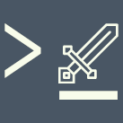
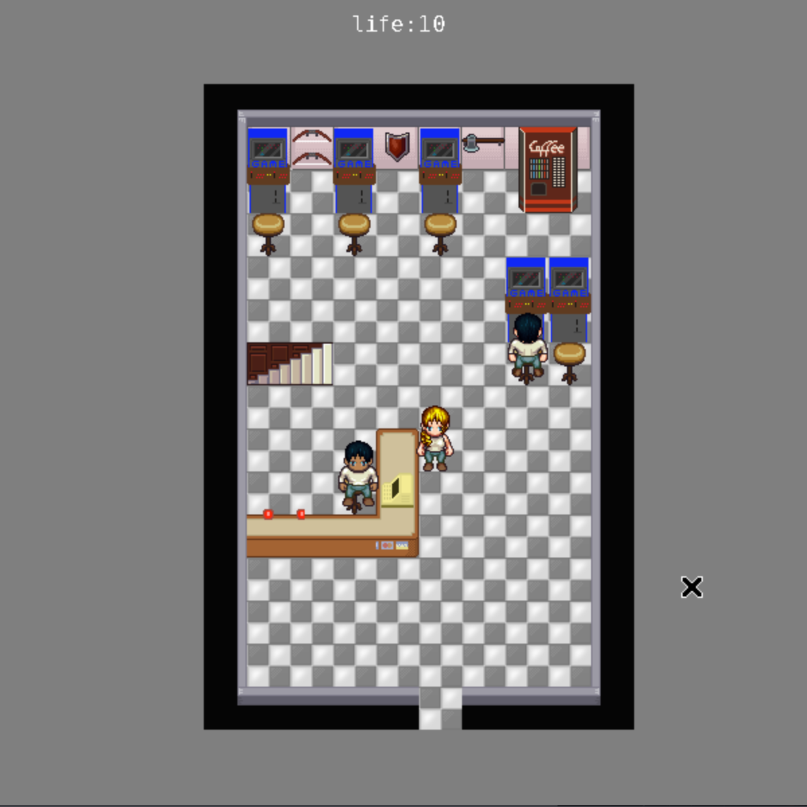

<div align="center">
  <br>
  
  <h1>YIRL isn't a Rogue-like</h1>
  <h3>A Work in progress game engine </h3>
  <h4>Aiming to be fully configurable, scriptable and mod friendly!</h4>
  <br>
  <a href="https://matrix.to/#/#yirlspace:matrix.org">
    
  </a>
  <a href="ircs://irc.libera.chat/yirl">
    
  </a>
  <a href="https://discord.gg/8QrKTtV">
    
  </a>
</div>

*irc server: libera chanel: #yirl*

- YIRL is a WIP,
- YIRL is a game engine aiming to be fully configurable, fully scriptable and mod friendly.
- YIRL has been started as an school project at EPITECH

|  | 
|:--:| 
| *A screenshot from the Sukeban project made with YIRL* |

_The first version, the one release at the end of my scholarship can be found on bitbucket: https://bitbucket.org/cosmo_ray/yirl/src_

---

## Concept:
The idea behind YIRL is to give to the user some basic tools and widgets that everyone can reuse or wrap into more complex widgets.
We can see YIRL as a CMS for video game:
Everyone should be able to add module to YIRL, and everyone should be able to wrap modules into more powerful modules.

As an example the [snake module](https://github.com/cosmo-ray/yirl/tree/master/modules/snake) is a map with more function and a init, it's basically an inheritance of a map, this allow everyone to add a snake easily in his game.
Snake module is written in lua, but as YIRL have a generic script system, we could have written snake in any scripting language.
Here is an example how Snake module can be use: https://github.com/cosmo-ray/yirl/tree/master/example/modules/snake.
Another example would be how I integrate most games widgets into my RPG Sukeban:
I first load the games modules in sukeban start.json: 
https://github.com/cosmo-ray/Sukeban/blob/master/start.json
like snake modules:
```json
    "pre-load" : [
 	     { "path" : "YIRL_MODULES_PATH/snake/", "type" : "module" },
       ...
```
An then create a widget that is of the type of the desired game that is then push in a container widget:
like in [action.lua](https://github.com/cosmo-ray/Sukeban/blob/master/actions.lua) playSnake function:
```lua
   local snake = Entity.new_array() -- create the array

   snake["<type>"] = "snake" -- set the widget type
   snake.dreadful_die = 1 -- internal stuff
   snake.hitWall = "snake:snakeWarp" -- which function to call when hit a wall (to make it me like snake2)
   snake.die = Entity.new_func("backToGame") -- what's happend when you die
   snake.quit = Entity.new_func("backToGame") -- when your quit... (backToGame is sukeban function to return to game)
   snake.resources = "snake:resources" -- resource to describe snake sprites/characters
   snake.background = "rgba: 255 255 255 255" -- widget background
   ywPushNewWidget(main, snake) -- push snake widget into main
```

supportted scripting languages are lua, C(with tinycc), scheme(s7), javascript(quickjs), php 5.3 (ph7), perl and yb(YIRL own asm) feel free to add your language :).

## how to start using YIRL
For now the easier way to use YIRL is to come chat with us and ask for help
But you can still understand how YIRL work by:
* using games using YIRL (https://uso.itch.io)
* modify some functionality form a game
* copy one to create your own game/module

## Modules
Modules are a very important part of YIRL, a modules can be a set of functions,
A widget that implement some game mechanism(like snake), or a full game (like game/vapz)

Each modules have a start file that will serve as entry file, and will tell YIRL how to load every other files.
It can be either a json file (start.json), or a C/lua/scheme/javascript file. how to load every other files

Note that for now some scripting languages doesn't support all platform.
Here's a Table of what support what:

| Language  | Linux | Windows | wasm |
| ------------- | ------------- | -- | -- |
| C  | :heavy_check_mark:  | :heavy_check_mark: | :x: |
| js  | :heavy_check_mark:  | :heavy_check_mark: | :heavy_check_mark: |
| php | :heavy_check_mark: | :x: | :heavy_check_mark: |
| lua | :heavy_check_mark: | :heavy_check_mark: | :heavy_check_mark: |
| perl | :heavy_check_mark: | :x: | :x: |
| scheme | :heavy_check_mark: | :heavy_check_mark: | :heavy_check_mark: |
| yb | :heavy_check_mark: | :heavy_check_mark: | :heavy_check_mark: |


##Start a game from the source
./yirl-loader.sh -P $PWD -d path/to/game/module

## building
Linux - Mac Os:
```
git submodule update --init
./configure
make
```

Due to the way Ubuntu package lua, you need to do `./configure -t ubuntu` instead of `./configure`

Windows:
you need to use msys2: http://www.msys2.org/
```
git submodule update --init
./configure -t mingw-i686
make
```

## Package Game
for windows you can use `package-game-mingw.sh` with mingw

for linux (like Arch Linux that I use BTW): `package-game.sh`

Both script are rarly used because I'm lazy and might require manual inervention to remove some lib
Also you should use an old distro (like centos 6) to package you game, otherwise old(or stable) distro might have incompatibility wih glibc

## Contribution
Obviously contributions are very welcome, to contribute you can simply make a Pull Request on GitHub, if something is wrong, I'll tell you :)
As I didn't have time to write a coding style, in case of contribution, you should just try to imitate code already in place.

I'd like to use Linux coding style, but this would require to change every functions and structures names.
A good contribution would be to make YIRL compatible with Linux coding style.

## Dependencies
Development package of these libs:

* glib2
* lua 53+
* sdl2, sdl2_image, sdl2_ttf
* json-c
* sdl2_mixer with a version >= 2.0.5 (you can use ./configure --clone-sdl-mixer)

## Tree:
* include: headers
  * sys: system header, that can be useful for TCC
    * queue.h: [man 3 queue](https://linux.die.net/man/3/queue)
  * tinycc: tcc libc header
  * YIRL: YIRL header, use internally and for TCC scripting, but so far, the best documentation, most functions have bindings
    * widget.h: widget base class and common widgets functions
    * events.h; check if a key have been press, windget contain functions to handle events too, but these one are better
    * map.h: a square map
    * menu.h; either a clasique menu or a panel
    * canvas.h: canvas API(for 2D rendering)
    * text-screen.h: a simple text widget.
    * container.h: widget that contain others widgets
    * pos.h: helpers to manipulate everything with a position
    * rect.h: helpers for rectangles
    * sdl-driver.h; internal, look away
    * keydef.h: keyboard touches define base on curses key numbers
    * game.h: starting point, initializ everything, and handle modules
    * entity.h: the YIRL entity system, use everywhere in the engine
    * debug.h: some debug functions
    * description.h: generic api for descriptions files(files that describe entities tree)
    * json-desc.h
    * script.h: generic api for scripting manipulation
    * lua-script.h
    * tcc-script.h
    * native-script.h: allow to create FunctionEntity from YIRL internal API
    * lua-binding.h: binding between yirl api and lua
    * block-array.h: yirl internal array use by ArrayEntity
    * sound.h: yirl abstract sound system
    * sound-libvlc.h: libvlc sound implementation
    * util.h
    * timer.h
* core: engine sources
* test: unit tests
* modules: set of basic YIRL modules, still used a lot, it contain some games too, tiled map parser, and a character generator that use Liberated Pixel Cup sprites
* games: old crap, on which I don't work anymore
* example: all examples are outdated
* doc: documents like sceenshot images

## Projects using YIRL
* https://uso.itch.io/pre-hangover-simulator
* https://harald8.itch.io/pre-hangover-quest
* https://uso.itch.io/warrior-of-asc-ii
* https://uso.itch.io/jims
* https://uso.itch.io/sukeban
* https://uso.itch.io/pewpew-pepper
* https://github.com/cosmo-ray/polis-at-war 

## for peoples who don't like github:
https://git.iglou.eu/Matthias/yirl

## License:
YIRL is licensed under the LGPL license, the idea behind that, is that you can add a modules under the license you want, but if you make a modification to the engine, you need to share it.

**Note: libperl is under Artistic or GPL 3.0, so if you use yirl with libperl, and libperl as gpl3, I guess YIRL became GPLed. (but not with Artistic License). licensing is weird, Anyway, You can use `--disable-perl` when `./configure`**

