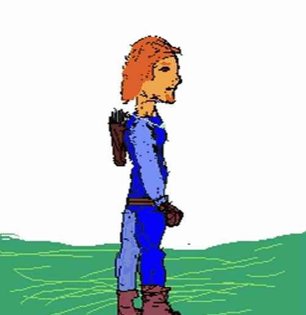

# Art ?
anim-desc.json: made by me, under CC-0

# Module Usage:
```json
{
  "<type>": "small-anim",
  "path": "DESC-PATH.json"
}
```

then look at [anim-desc.json](anim-desc.json) for example

# Demo



Bote that the module handle condition, so in this case, you can change the guy armor,
by adjusting 'armor-lvl' in code.
